# 🎨 FairStart Frontend Architecture

**AI-powered Resume Workspace for Job Seekers · Visual · Exportable · Feedback-driven**

⚛️ React SPA | 🎭 Progress Simulation | 📄 ATS-Friendly Resume Generation  
🧠 HR-Style Feedback | 🔐 JWT Auth | 🐳 Docker Deployment

> 📌 **For Chinese Version:**  
> 👉 [点击查看中文版 README](/README_CN.md)

<div align="center">
  
  
  
  
  
</div>

---

# 🎯 Project Overview

**FairStart** is an intelligent, visual, and exportable platform for resume creation and optimization.

Unlike traditional resume forms, FairStart’s frontend acts as a **full-featured resume workstation**:

**“Resume Input → AI Optimization → HR-style Feedback → PDF/Word Export”**

---

# ✨ Core Frontend Features & Architecture

## 1️⃣ Dual Input Modes (Form + Upload)

### 📌 Form-based Input
- Modular input for personal info, education, experience, projects, skills  
- Real-time validation  
- Autosaves to `localStorage` to prevent data loss  
- Axios + JWT to request AI optimization  
- Backend returns structured JSON → instantly rendered in UI  

### 📌 Resume Upload + JD Mode
- Upload PDF/Word resume  
- Paste job description directly  
- Backend multi-agent workflow parses content into structured data  
- Auto-filled UI → enters optimization pipeline  

---

## 2️⃣ Custom ResumePreview Component

Built using **React + Tailwind CSS**:

- Renders backend JSON into a clean resume layout  
- Fully **ATS-optimized** structure  
- Real-time preview (no reload)  
- One-click export to PDF / Word  
- Modular layout → expandable templates/themes  
- Printing optimized (links rendered as plain text)

> **Frontend renders final resume layout; backend only produces content.**

---

## 3️⃣ HR-Style Feedback System

Backend returns:

- Match score  
- Job-related strengths  
- Risk points  
- Improvement suggestions for each experience  

Frontend displays:

- Tag-based feedback (e.g., *High Match*, *Needs Quantification*)  
- Per-experience suggestions  
- Tailwind-based clean card UI  

Creates a realistic **“feedback from an actual recruiter”** experience.

---

## 4️⃣ Progress Simulation (Non-streaming AI UX)

AI processing takes 2–3 minutes → frontend simulates progress:

- ✔ Fake progress bar  
- ✔ Skeleton UI  
- ✔ Stage-based hints  
- ✔ Animated transitions  

Stages include:

```
Parsing resume…
Optimizing bullet points…
Evaluating JD fit…
Generating final summary…
```

This provides a **steady, controlled, user-friendly loading experience**.

---

# 🧱 Tech Stack

| Technology | Purpose |
|-----------|---------|
| React | SPA + component-driven UI |
| Tailwind CSS | Modern UI + responsive styling |
| Axios | API requests + JWT injection |
| localStorage + JWT | Authentication & persistence |
| React Router | Routing management |
| Docker | Deployment |

---

# 🔄 Client–Server Flow (Mermaid)

```mermaid
graph TB
    U[User UI<br/>React] --> F1[Choose Mode<br/>Form / Upload + JD]

    F1 --> F2[Fill Info or Upload]
    F2 --> F3[Request AI Optimization]

    F3 --> P[Fake Progress Bar<br/>Skeleton]
    F3 --> A[Axios + JWT → FastAPI]

    A --> B[Backend Multi-Agent Workflow<br/>LangGraph + DeepSeek + Qwen3]
    B --> C[Returns Structured JSON<br/>Resume + Score + Suggestions]

    C --> V[ResumePreview<br/>Live Rendering]
    C --> R[HR Feedback]

    V --> D[Export PDF/Word]
    D --> S[Backend File Generation → Download]
```



---

# ⚙ Engineering Practices

- React component best practices  
- Axios interceptors (JWT + unified error handling)  
- Tailwind abstraction + utility reuse  
- Prevent duplicate submissions  
- Local caching for auto-save  

---

# 📄 Main Functional Modules

- Personal Info  
- Education  
- Work Experience  
- Projects  
- Skills  
- Certificates  
- Career Summary  
- HR Feedback  
- Dual Input: Form / Upload  
- Export to PDF & Word  

---

# 🚀 Getting Started (React + Vite)

```bash
git clone https://github.com/626-Legendary/ai-resume.git
cd ai-resume
npm install
npm run dev
```

Build:

```bash
npm run build
```

---

# 📦 Deployment Options

Supported platforms:

- **Vercel (recommended)**
- Netlify  
- GitHub Pages  
- Docker + Nginx  
- Traditional Nginx / Apache  

---

# 🔒 Data Security

- JWT persisted on frontend  
- Axios auto-attaches token  
- Strict field validation  
- Default: all data stored locally only  
- Optional backend HTTPS + data cleanup policies  

---

# 📁 Project Structure (Key Files)

```
src/
  components/dashboard/
    DashboardCreate.jsx      
    ResumePreview.jsx        
    DashboardEnhance.jsx     
  components/home/
  components/ui/
  App.jsx
  main.jsx
  router.jsx
vite.config.js
README.md / README_CN.md
```

---

# 🧬 Data Model (Sample)

```json
{
  "PersonalInfo": { "firstName": "", "lastName": "", "email": "" },
  "WorkExperience": [
    { "jobTitle": "", "company": "", "description": "" }
  ],
  "Education": [],
  "Projects": [],
  "Skills": "",
  "Certificates": [],
  "Summary": ""
}
```

Stored in:

```
localStorage["ai-resume-data"]
```

---

# 🧩 Key Components

### `DashboardCreate.jsx`
- Multi-step forms  
- Local cache buffer  
- Builds previewData  
- `generateResumeHTML()`  
- `printResume()`  
- Local persistence  

### `ResumePreview.jsx`
- Live rendering  
- Printing optimization  
- DOM-based pagination  

### `DashboardEnhance.jsx`
- PDF/DOC upload  
- JD paste support  
- AI invocation (extendable)  

---

# 🛠 Searchable Keywords (Quick Reference)

- `generateResumeHTML`
- Pagination logic  
- Print compatibility  
- Axios interceptor  
- File export logic  

---

# 🧪 Development Tips

```bash
npm run dev
npm run build
npm run preview
```

---

# 🔐 Privacy Notes

- No server-side data storage by default  
- Optional HTTPS enforcement  
- Designed to keep all user data local  

---

# 📌 Symbol Index

- `DashboardCreate.jsx` → HTML export / print  
- `ResumePreview.jsx` → Pagination / formatting  
- `DashboardEnhance.jsx` → Upload + JD UI  
- `vite.config.js` → Alias config  
