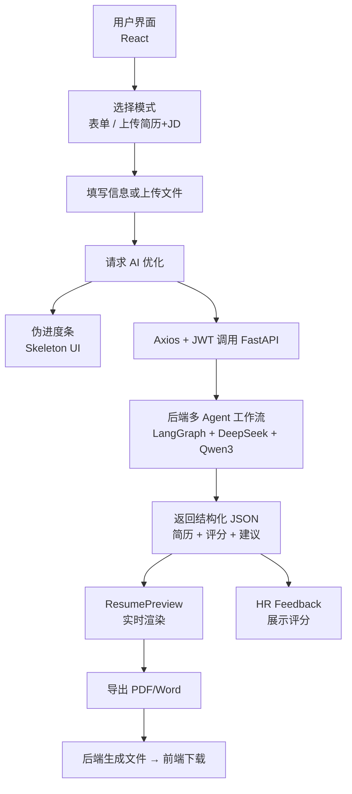

# 🎨 FairStart 前端技术架构

**面向求职者的 AI 简历工作台 · 可视化 · 可下载 · 可反馈**

⚛️ React SPA | 🎭 进度模拟优化 | 📄 ATS 友好简历生成  
🧠 HR 评价式反馈 | 🔐 JWT | 🐳 Docker

<div align="center">
  
  
  
  
  
</div>

---

# 🎯 项目简介

**FairStart** 是一个 *智能化、可视化、可导出* 的简历生成与优化平台。

不同于传统简历填写工具，本项目前端承担完整的简历工作台职责：

**“简历录入 → AI 优化 → HR 风格反馈 → 导出 PDF/Word”**

<p align="center">
  <table>
    <tr>
      <td align="center" style="padding: 8px;">
        
        <div style="font-size: 12px; color: #666; margin-top: 4px;">
          FairStart product overview
        </div>
      </td>
      <td align="center" style="padding: 8px;">
        
        <div style="font-size: 12px; color: #666; margin-top: 4px;">
          Feature highlights & capabilities
        </div>
      </td>
      <td align="center" style="padding: 8px;">
        
        <div style="font-size: 12px; color: #666; margin-top: 4px;">
          Guided resume builder introduction
        </div>
      </td>
    </tr>
  </table>
</p>
---

# ✨ 前端核心功能与架构设计

## 1️⃣ 双模式简历输入（Form + Upload）

### 📌 表单式输入模式
- 分模块填写（个人信息 / 教育 / 经历 / 项目 / 技能）
- 实时校验格式与长度
- 自动保存到 `localStorage` 防刷新丢失
- 使用 Axios + JWT 调用后端 AI 优化接口
- 后端返回结构化 JSON → 实时渲染

### 📌 上传简历 + JD 模式
- 支持上传 PDF / Word
- 支持直接粘贴 JD 文本
- 后端多 Agent 工作流自动解析
- 自动落盘到 UI 中并进入优化流程

---

## 2️⃣ 自研 ResumePreview（可视化简历预览）

基于 **React + Tailwind CSS** 实现：

- 动态渲染后端结构化 JSON
- 严格符合 **ATS 友好格式**
- 实时预览，无需重新加载
- 一键导出 PDF / Word
- 模块化布局，支持更多模板扩展
- 打印友好（链接自动转纯文本）

> **FairStart 前端负责最终简历布局；后端只产出内容。**

---

## 3️⃣ HR Feedback（模拟 HR 招聘评价）

后端返回：

- 匹配度评分  
- 岗位亮点  
- 潜在风险点  
- 每条经历的修改建议  

前端呈现：

- 标签化（如「匹配度高」「需要量化」）  
- 每条经历逐条点评  
- Tailwind 模块化 UI  

---

## 4️⃣ 非流式 AI 等待体验（Progress Simulation）

AI 优化耗时 2–3 分钟，因此设计：

- ✔ 伪进度条（Fake Progress Bar）  
- ✔ Skeleton UI 骨架屏  
- ✔ 分阶段提示文案  
- ✔ 动画增强“反馈感”  

阶段示例：

```
Parsing resume…
Optimizing bullet points…
Evaluating JD fit…
Generating final summary…
```

---

# 🧱 技术栈（Tech Stack）

| 技术 | 用途 |
|------|------|
| React | SPA + 组件化 |
| Tailwind CSS | 现代化 UI + 响应式布局 |
| Axios | API 调用、JWT 拦截器 |
| localStorage + JWT | 认证 + 持久化 |
| React Router | 路由管理 |
| Docker | 容器化部署 |

---

# 🔄 前后端交互流程（Mermaid）



---

# ⚙ 前端工程实践

- React 组件最佳实践  
- Axios 拦截器：JWT 自动注入 & 错误统一提示  
- Tailwind 抽象 + 工具类复用  
- 防重复提交（按钮禁用 + loading）  
- 自动缓存表单数据（localStorage）

---

# 📄 主要功能模块

- 个人信息  
- 教育背景  
- 工作经历  
- 项目经验  
- 技能（自动格式化）  
- 证书  
- 职业总结  
- HR 风格反馈  
- 双模式输入（表单/上传）  
- 一键导出 PDF / Word  

---

# 🚀 项目启动（React + Vite）

```bash
git clone https://github.com/626-Legendary/ai-resume.git
cd ai-resume
npm install
npm run dev
```

构建：

```bash
npm run build
```

---

# 📦 部署方式

支持平台：

- **Vercel（推荐）**
- Netlify  
- GitHub Pages  
- Docker（含 Nginx）  
- Nginx / Apache  

---

# 🔒 数据安全

- JWT 前端持久化  
- Axios 自动附加 token  
- 严格字段校验  
- 默认：只存浏览器本地，不上传服务器  
- 可选：后端启用 HTTPS + 数据清理策略  

---

# 📁 项目结构（关键文件）

```
src/
  components/dashboard/
    DashboardCreate.jsx      # 主流程 + export + print
    ResumePreview.jsx        # 实时预览 + 分页逻辑
    DashboardEnhance.jsx     # 上传解析 + JD 模式
  components/home/
  components/ui/
  App.jsx
  main.jsx
  router.jsx
vite.config.js
README.md / README_CN.md
```

---

# 🧬 数据模型（示例）

```json
{
  "PersonalInfo": { "firstName": "", "lastName": "", "email": "" },
  "WorkExperience": [
    { "jobTitle": "", "company": "", "description": "" }
  ],
  "Education": [],
  "Projects": [],
  "Skills": "",
  "Certificates": [],
  "Summary": ""
}
```

数据存储：

```
localStorage["ai-resume-data"]
```

---

# 🧩 关键组件职责

### `DashboardCreate.jsx`
- 多步骤流程  
- `localStepDataRef` 缓冲输入  
- 构建 `previewData`  
- `generateResumeHTML()`  
- `printResume()`  
- 自动缓存浏览器  

### `ResumePreview.jsx`
- 实时渲染  
- 打印格式优化  
- DOM 分页算法  

### `DashboardEnhance.jsx`
- 上传 PDF/DOC  
- JD 粘贴  
- 调用 AI（可扩展）

---

# 🛠 关键实现点（可搜索定位）

- HTML 导出：`generateResumeHTML`  
- 分页逻辑：隐藏 DOM 测量  
- 打印兼容：链接 → 纯文本  

---

# 🧪 本地开发与调试

```bash
npm run dev
npm run build
npm run preview
```

---

# 🔐 安全与隐私

- 本地浏览器存储  
- 可选启用后端 HTTPS  
- 不做持久化数据保存  

---

# 📌 快速定位（符号索引）

- `DashboardCreate.jsx` → HTML 导出 / 打印  
- `ResumePreview.jsx` → 分页 / 格式化  
- `DashboardEnhance.jsx` → 上传解析  
- `vite.config.js` → 别名配置
